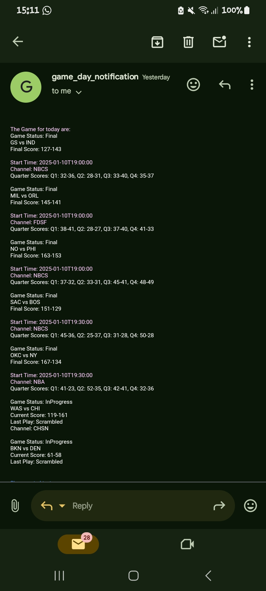

# NBA GAME SEVERLESS NOTIFICATION SYSTEM USING AWS TECHNOLOGIES

### Introduction

In the world of sports, staying updated with game schedules is crucial for enthusiastic fans. This document details the architecture and functionality of a notification system that informs subscribed users about NBA games using AWS services. The system utilizes AWS Lambda, EventBridge, an external API, and Amazon SNS.

### Architecture Overview

* **AWS Lambda** : The core of the system, responsible for executing code in response to triggers.
* **EventBridge** : Acts as an event bus that triggers the Lambda function on a cron-based schedule.
* **External API** : Fetches data related to NBA games.
* **Amazon SNS** : Sends notifications to users about upcoming games.

### System Workflow

1. **Event Scheduling** : AWS EventBridge triggers the Lambda function based on a predefined cron schedule (e.g., once a day).
2. **API Call** : The Lambda function makes an HTTP request to an external API to fetch current NBA game information.
3. **Data Processing** : The function processes the obtained data to extract relevant details (e.g., game time, teams, game-status, channel, scores e.t.c).
4. **User Notification** : The processed data is sent to subscribed users via Amazon SNS.


### Implementation Steps

1. **Set Up AWS Lambda**

   * Create a new Lambda function in the AWS Management Console.
   * Write the [code](./lambda_function/main.py) to fetch NBA data from the chosen external API, process the response, and prepare it for notification.
2. **Configure EventBridge**

   * Create a rule in AWS EventBridge to trigger the Lambda function according to your specified schedule.
   * Set the cron expression to dictate the execution time (e.g., `cron(0 8 * * ? *)` for 8 AM UTC daily).
3. **Integrate with External API**

   * Identify a reliable API source for NBA game data.
   * Implement error handling in the Lambda function to manage API failures gracefully.
4. **Set Up Amazon SNS**

   * Create an SNS topic for user notifications.
   * Add subscribers (users) to the topic, ensuring that they receive notifications via their preferred method (e.g., SMS, email).
5. **Testing and Deployment**

   * Test the entire flow manually to ensure data is fetched, processed, and sent correctly.
   * Deploy the Lambda function and monitor logs using AWS CloudWatch for troubleshooting.

#### Implementation Using [terraform](./terraform)

```bash
git clone https://github.com/fakiletemmytope/NBA_games_notification_system.git
cd NBA_games_notification_system/terraform
terraform init
terraform fmt; terraform validate
terraform apply -auto-approve
```

Note: To implement using terraform, terraform must be installed and the AWS credentials set. Also to clean up run the command: `terraform destroy -auto-approve`

***Sample of notification sent to a user:***



### Conclusion

The NBA Game Notification System efficiently informs users about game schedules using a serverless architecture on AWS. This setup provides scalability, reliability, and ease of management, enhancing the experience for NBA fans.
